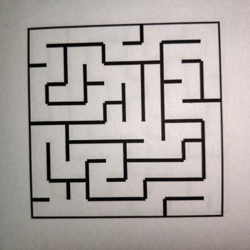
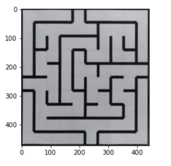
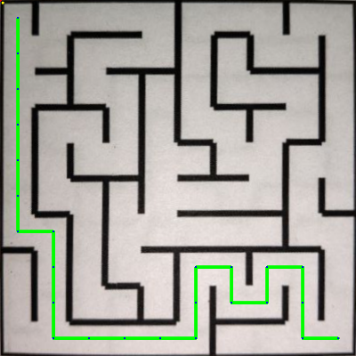

# Path-Visualisation-Maze
This is a Code for path visualisation of Maze
Steps : 
1. Read an image. 
2 . Apply perspective function on input image 
3. Encode the maze image in maze_array 
4. Find the path 
5. Draw the path 

#Input Image  

# After applying perspective function on input image  
  

#Encoded Maze array  
Encoded Maze Array = [[3, 10, 10, 14, 7, 11, 10, 10, 10, 6], [5, 3, 6, 11, 0, 6, 11, 2, 14, 5], [5, 5, 9, 6, 5, 9, 6, 9, 6, 5], [5, 5, 7, 5, 5, 3, 12, 3, 4, 13], [13, 5, 5, 9, 12, 5, 3, 12, 1, 14], [11, 12, 1, 6, 3, 12, 5, 3, 12, 7], [7, 7, 5, 9, 12, 3, 12, 9, 6, 5], [5, 5, 5, 3, 6, 5, 3, 14, 5, 5], [5, 9, 8, 12, 9, 4, 9, 10, 12, 5], [9, 10, 10, 10, 14, 13, 11, 10, 10, 12]]
 

# Path between (0,0) to (9,9)
[[(0, 0), (1, 0), (1, 1), (1, 2), (2, 2), (3, 2), (3, 1), (3, 0), (4, 0), (5, 0), (6, 0), (7, 0), (7, 1), (7, 2), (8, 2), (8, 3), (8, 4), (8, 5), (8, 6), (8, 7), (9, 7), (9, 8), (9, 9)]]
 

#Output Image  
  
